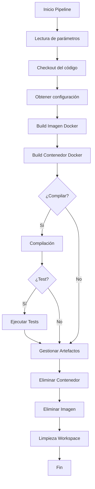

# Auto PIOPS - Jenkins CI/CD

## Descripción

Esta pipeline permite implementar procesos de Integración Continua (CI) y
Entrega Continua (CD) usando Jenkins, Docker y Git. Está diseñada para facilitar
la automatización de compilación, pruebas y despliegue de aplicaciones.

## ¿Cómo funciona?

El flujo principal se basa en pipelines de Jenkins que ejecutan las siguientes
etapas:

1. **Lectura de parámetros** - Configuración inicial del pipeline
2. **Checkout del código fuente** - Descarga del repositorio Git
3. **Obtención de configuración** - Carga de parámetros específicos
4. **Construcción de imagen Docker** - Build de la imagen base
5. **Construcción de contenedor Docker** - Creación del entorno de ejecución
6. **Compilación y pruebas** - Proceso de build y testing
7. **Gestión de artefactos** - Almacenamiento de resultados
8. **Limpieza de recursos** - Eliminación de recursos temporales

## Diagrama de Flujo



## Estructura del Proyecto

```text
├── src/main/jenkins/utils/
│   ├── DockerUtils.groovy      # Métodos para Docker
│   ├── GitUtils.groovy         # Métodos para Git
│   ├── FileUtils.groovy        # Utilidades de archivos
│   └── LoggerUtils.groovy      # Métodos de logging
├── src/main/jenkins/data/
│   └── DBconector.groovy       # Conexión a base de datos
├── vars/
│   ├── Builder.groovy          # Pipeline principal CI/CD
│   └── Test.groovy             # Pipeline de pruebas
├── resources/
│   └── querys.json             # Consultas SQL de ejemplo
├── LICENSE                     # Licencia del proyecto
└── README.md                   # Este archivo
```

## Componentes Principales

### Pipeline Builder (`vars/Builder.groovy`)

El pipeline principal que orquesta todo el proceso de CI/CD. Incluye:

- Gestión de parámetros de entrada
- Integración con Git para checkout de código
- Construcción automatizada con Docker
- Ejecución de tests y validaciones
- Gestión de artefactos generados
- Limpieza automática de recursos

### Utilidades Docker (`src/main/jenkins/utils/DockerUtils.groovy`)

Conjunto de métodos para:

- Construcción de imágenes Docker
- Gestión de contenedores
- Limpieza de recursos Docker
- Configuración de entornos

### Utilidades Git (`src/main/jenkins/utils/GitUtils.groovy`)

Métodos para:

- Checkout de repositorios
- Gestión de branches
- Configuración de credenciales
- Operaciones Git avanzadas

### Logger Utils (`src/main/jenkins/utils/LoggerUtils.groovy`)

Sistema de logging que proporciona:

- Logs estructurados
- Niveles de logging configurables
- Trazabilidad del pipeline
- Reportes de ejecución

## Configuración

### Prerequisitos

- Jenkins instalado y configurado
- Docker disponible en el agente Jenkins
- Acceso al repositorio Git
- Credenciales configuradas en Jenkins

### Pasos de Instalación

1. **Clonar el repositorio**:

   ```bash
   git clone https://github.com/Zoimback/auto-piops.git
   ```

2. **Configurar Jenkins**:

   - Instalar plugins necesarios (Pipeline, Docker, Git)
   - Configurar credenciales de acceso
   - Crear nuevo pipeline job

3. **Configurar el pipeline**:

   - Apuntar al `vars/Builder.groovy` como pipeline principal
   - Configurar parámetros según el proyecto
   - Establecer triggers automáticos

## Uso

### Pipeline Básico

```groovy
@Library('auto-piops') _

Builder {
    gitRepository = 'https://github.com/tu-usuario/tu-proyecto.git'
    dockerImage = 'tu-imagen:latest'
    runTests = true
    compileProject = true
}
```

### Pipeline con Configuración Personalizada

```groovy
@Library('auto-piops') _

Builder {
    gitRepository = 'https://github.com/tu-usuario/tu-proyecto.git'
    gitBranch = 'develop'
    dockerImage = 'tu-imagen:v1.0.0'
    dockerFile = 'Dockerfile.custom'
    runTests = true
    compileProject = true
    artifactPath = 'build/artifacts'
    notifyEmail = 'team@empresa.com'
}
```

## Personalización

### Añadir Nuevas Etapas

Puedes extender el pipeline añadiendo nuevas etapas:

```groovy
// En vars/Builder.groovy
stage('Deploy to Staging') {
    steps {
        script {
            // Lógica de despliegue
        }
    }
}
```

### Configurar Notificaciones

```groovy
post {
    always {
        emailext (
            subject: "Pipeline Status: ${currentBuild.result}",
            body: "El pipeline ha terminado con estado: ${currentBuild.result}",
            to: "${params.notifyEmail}"
        )
    }
}
```

### Integrar con Base de Datos

Utiliza `DBconector.groovy` para operaciones con BD:

```groovy
def db = new DBconector()
db.connect()
def results = db.executeQuery("SELECT * FROM deployments")
```

## Ejemplos de Uso

### Proyecto Java con Maven

```groovy
Builder {
    gitRepository = 'https://github.com/empresa/proyecto-java.git'
    dockerImage = 'maven:3.8-openjdk-11'
    compileCommand = 'mvn clean compile'
    testCommand = 'mvn test'
    packageCommand = 'mvn package'
}
```

### Proyecto Node.js

```groovy
Builder {
    gitRepository = 'https://github.com/empresa/proyecto-node.git'
    dockerImage = 'node:16-alpine'
    compileCommand = 'npm install'
    testCommand = 'npm test'
    packageCommand = 'npm run build'
}
```

## Troubleshooting

### Problemas Comunes

**Error de conexión Docker**:

```bash
# Verificar que Docker esté ejecutándose
sudo systemctl status docker
```

**Problemas de permisos Git**:

```bash
# Configurar credenciales SSH
ssh-keygen -t rsa -b 4096 -C "jenkins@empresa.com"
```

**Fallos en la compilación**:

- Revisar logs en `LoggerUtils`
- Verificar configuración de la imagen Docker
- Comprobar dependencias del proyecto

## Monitoreo y Métricas

El pipeline genera automáticamente:

- **Logs detallados** de cada etapa
- **Métricas de tiempo** de ejecución
- **Reportes de tests** (si están configurados)
- **Alertas** en caso de fallos

## Contribución

Para contribuir al proyecto:

1. Fork del repositorio
2. Crear branch para nueva funcionalidad
3. Implementar cambios con tests
4. Enviar Pull Request

## Recursos Adicionales

- [Jenkins Pipeline Documentation](https://www.jenkins.io/doc/book/pipeline/)
- [Docker Documentation](https://docs.docker.com/)
- [Groovy Documentation](https://groovy-lang.org/documentation.html)
- [Git Documentation](https://git-scm.com/doc)

## Licencia

Este proyecto está bajo la licencia especificada en el archivo `LICENSE`.

---

> **Nota**: Esta plantilla es un punto de partida flexible. Adáptala según
> las necesidades específicas de tu flujo de trabajo, requisitos de seguridad
> y estándares organizacionales.
